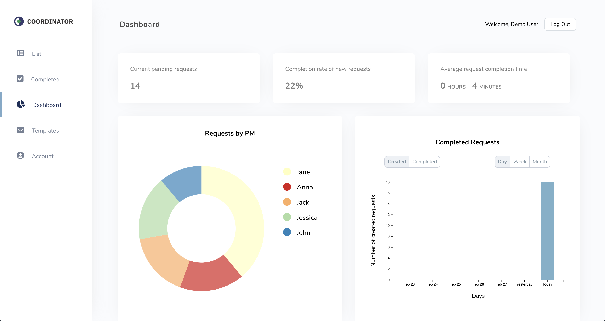

# Coordinator Tool
Streamline your coordinator workflow

Live app: https://zoeferencova-coordinator-tool.now.sh/

## Summary

As a client service coordinator, I found that there were many aspects of my job that were repetitive and inefficient. I would write the same email dozens of times in one day and keep track of all of my correspondence in a notebook where I had to rewrite my task list every day. I created the coordinator tool to address these pain points and automate as much of the job as possible.

The coordinator tool makes tracking reach-outs and organizing tasks extremely easy. The main list tab and completed tab can be used to track, change and revert the status of items as well as link to external sites for easy navigation. Users are able to create email templates for emails that are commonly sent which then template in values from the item list so that emails can be composed and populated with values for each list item in one click. The dashboard page keeps track of some key statistics that allow the user to keep track of request volume trends as well as other insightful stats and KPI's.

## Screenshots

### Main List Page:

### Completed List Page:

### Dashboard Page:

### Templates Page:

### Account Page:

## Technology Used

### Front-end:
React with CSS Modules
D3 for visualizations

### Back-end:
Node.js with Express
PostgreSQL with Knex
JWT for authentication
Mocha for testing